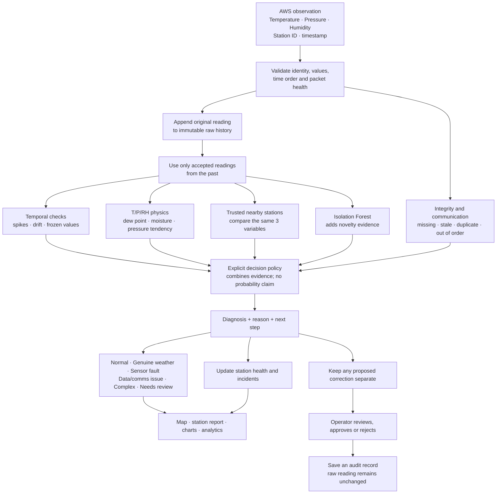

# SkyGuard

### Trustworthy observations from India’s Automatic Weather Station network

**SIH 2026 · Problem SIH26073 · MoES / India Meteorological Department**

SkyGuard checks whether an AWS reading looks like **normal behaviour, genuine weather, or a sensor/data problem**. It uses only **temperature, atmospheric pressure and relative humidity (T/P/RH)**. It gives operators the evidence behind a diagnosis, while preserving the original measurement.

> **In one glance:** Readings → past and peer checks → explained decision → human review when needed.

[Run locally](#-run-it) · [How it works](#-how-it-works) · [What the UI shows](#-what-you-see-in-the-ui) · [Results](#-what-has-been-tested) · [Limits](#-important-limits)

---

## 🧭 How it works



### The simple version

1. **Receive:** a station sends T/P/RH readings with its identity and timestamp. Metadata helps order and route packets; it is not another weather input.
2. **Check:** SkyGuard validates the packet, then compares the reading with that station’s past and trusted neighbours. Physics values such as dew point are calculated from T/P/RH; they are not extra sensors.
3. **Explain:** a rule-based decision policy combines temporal, physical, spatial, integrity and ML novelty evidence. It returns a class, supporting reasons and a suggested next step.
4. **Review:** operators investigate incidents and decide on correction proposals. The received raw values are never edited by a proposed correction.

### What the labels mean

| Result | Meaning in the prototype |
|---|---|
| **Normal** | The reading is consistent with available checks. |
| **Genuine weather** | A change is supported by the station’s T/P/RH behaviour and trusted nearby stations. |
| **Sensor fault** | Evidence points to a faulty or implausible sensor reading. |
| **Data / communications issue** | A packet is missing, stale, duplicated, late, or otherwise has an integrity problem. |
| **Complex** | Weather and fault evidence may coexist; coverage is limited. |
| **Needs review** | Evidence or history is insufficient to make a confident call. |

These are **baseline operational classes**, not calibrated probabilities. An Isolation Forest anomaly score is supporting novelty evidence, not the final diagnosis.

---

## 🖥️ What you see in the UI

| View | What it helps an operator do |
|---|---|
| **Overview** | Scan network availability, active incidents and station status on the India map. |
| **Stations** | Search/filter stations and open a station’s report. |
| **Station report** | Inspect T/P/RH charts, history, nearby-station context, physics transforms, twin estimates and the evidence behind a decision. |
| **Incidents** | Investigate a flagged event, add notes and record review status. |
| **Analytics** | Review stored decisions, class metrics and the separate synthetic evaluations. |
| **Data** | Explore date-filtered history, compare stations, view the dataset evaluation ledger and export CSV. |
| **Reports** | Generate summaries from stored observations and decisions. |
| **Settings / Scenario Lab** | Inspect system state or run a clearly labelled synthetic scenario through the same pipeline. |

The map is a geographic station view, not a weather input. Street detail is best-effort OpenStreetMap content at close zoom. The simulator and generated station locations are synthetic and should not be mistaken for registered physical AWS installations.

---

## 🧠 Models and methods

SkyGuard is a **hybrid diagnostic baseline**, not one end-to-end neural classifier:

| Component | Role | Current implementation |
|---|---|---|
| **Integrity checks** | Catch packet and timestamp problems before they become misleading diagnoses. | Schema, duplicate/order/future/staleness checks, heartbeat and gap handling. |
| **Temporal checks** | Find unusual changes in one station’s own history. | Past-only rates, projections/residuals, spikes, drift and frozen-value guards. |
| **T/P/RH physics** | Check whether the three measurements behave coherently. | Derived moisture/thermodynamic quantities and pressure/variable tendencies. All are derived from T/P/RH. |
| **Spatial checks** | Ask whether nearby trusted stations show a similar change. | Compare the same three variables and their recent trends; suspicious peers are excluded or down-weighted. |
| **Isolation Forest** | Add evidence that a feature pattern is unusual. | Active v2 artifact uses 160 trees and six causal, T/P/RH-derived runtime features. Its score is not a probability. |
| **Decision policy** | Turn evidence into a useful operator outcome. | Explicit ordered rules and persistence checks; learned calibrated fusion is not implemented. |
| **EdgeGuard** | Demonstrate compact edge anomaly screening. | Separate INT8 autoencoder: 12 past timestamps × 3 inputs (36 values), `36 → 32 → 8 → 32 → 36`; model file is 8,336 bytes. |

EdgeGuard is a separate embedded-model prototype. The scenario lab’s disconnect/buffer/replay mode is a **software emulator**, not an attached board running this model.

---

## 📊 What has been tested

The active v1/v2 comparison uses the **same 4,032 synthetic test observations** for both versions. Station identities and dates are held out from fitting, but the generator family is shared. Results are development evidence, not field accuracy.

| Measure | Frozen v1 | Candidate v2 |
|---|---:|---:|
| Fault recall | 77.5% | **85.8%** |
| Fault precision | 100.0% | 100.0% |
| Macro F1 across six classes | 0.593 | **0.614** |
| Normal observations incorrectly called faults | 0.0% | 0.0% |
| Recorded p95 diagnosis time | 14.13 ms | 21.29 ms |

The p95 values are saved-run measurements, not a device or deployment load benchmark. **Genuine-weather detection remains weak**, and the test cohort has no supported complex fault-plus-weather examples. See [the full v2 evaluation](docs/ML_IMPROVEMENT.md) for class-by-class results and the separate 12,000-case archive stress test; those two cohorts are not directly comparable.

The EdgeGuard chart shows its saved **validation reconstruction error** across training epochs. Isolation Forest does not have a neural-network loss curve, so no artificial loss graph is reported for it.

---

## 🚀 Run it

### Requirements

- Node.js 22 or newer
- [`uv`](https://docs.astral.sh/uv/)
- Python 3.12 (installed by `uv` when needed)

### Start the dashboard and API

```bash
make setup
make dev
```

- Dashboard: <http://127.0.0.1:5173>
- API documentation: <http://127.0.0.1:8010/docs>
- Local database: `data/skyguard.db` (SQLite)
- Stop both services with **Ctrl+C**.

On a fresh local database, simulation mode seeds the demo network. It does not connect to IMD. Existing databases are upgraded additively; **do not delete or reset the database just to restart the app**.

To run services separately, use two terminals:

```bash
make api
make ui
```

### Useful project commands

| Command | Purpose |
|---|---|
| `make test` | Run Python/API/science/persistence tests and portable C++ edge tests. |
| `make build` | Type-check and build the React/Vite frontend. |
| `make train` | Train the synthetic Isolation Forest artifact. |
| `make evaluate` | Run the original synthetic regression evaluation. |
| `make expand-dataset` | Add the 500-station, 90-day synthetic archive; stop the API and pause simulation first. |
| `make evaluate-archive` | Evaluate 12,000 controlled copies of archived samples; does not rewrite raw observations. |
| `make train-edge` | Train and quantize the separate EdgeGuard model; uses extra TensorFlow dependencies. |

For the full 500-station dataset workflow and its limits, read [docs/EVALUATION.md](docs/EVALUATION.md).

---

## ☁️ Deployment shape

The frontend is **React + Vite**, while the diagnosis service is **Python + FastAPI**. Cloudflare Pages can host the static frontend; it does not run this Python backend. The backend needs a Python host, with PostgreSQL available through Supabase or another compatible database.

See [Supabase and Cloudflare deployment instructions](docs/SUPABASE_DEPLOYMENT.md) for the prepared subset, environment variables and build settings. Keep database URLs and API keys on the backend; never put private credentials in Vite’s public environment variables or commit them to Git.

---

## ⚠️ Important limits

- The demonstration data and model training data are synthetic; no real AWS/IMD feed or independent field validation is included.
- Weather-versus-fault separation is a known weakness. The model does not output calibrated probabilities.
- The detector is a rules-plus-evidence baseline; learned fusion, conformal uncertainty, long-history seasonal models and automatic drift-based model rollback are not implemented.
- The autoencoder has been quantized and tested on a desktop host. No MCU board build, flash, power, or hardware latency measurement is claimed.
- The service is a single-process prototype. Production authentication/RBAC, high availability, multi-worker coordination, retention policy, and large-network load validation remain open work.
- Generated map locations, street coverage and synthetic histories are for demonstration. Raw readings are append-only; correction proposals and human decisions are stored separately.

See [docs/LIMITATIONS.md](docs/LIMITATIONS.md) for the detailed status and the [T/P/RH revision](references/tprh-revision.txt) for the strict input contract.

---

## 🗂️ Project map

```text
backend/app/      FastAPI routes, persistence, science and simulation
frontend/src/     React UI, map, station reports and charts
ml/               Isolation Forest training, evaluation and artifacts
edge/             Portable edge screening, buffer and INT8 model
docs/             Methodology, evaluation, deployment and limitations
references/       SIH brief and the T/P/RH-only revision
```

For development history and handoff details, start with [WORK_LOG.md](WORK_LOG.md). The original station map integration boundary is [frontend/src/Map.tsx](frontend/src/Map.tsx).
