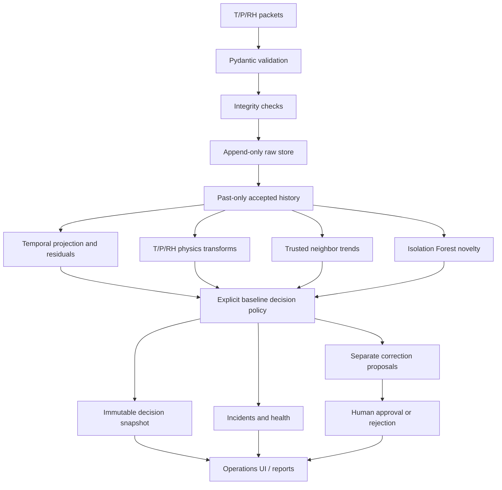

# System design

The current implementation is a single-process modular monolith, with a React client and optional PostgreSQL persistence. Its local development database is SQLite. The requested full architecture remains a roadmap rather than a claim of production completeness.

## Data and time

`Observation.timestamp_utc` is the event time; `Raw.received_at` is the independently recorded delivery time. The service checks identity, station registration, numeric finiteness, ordering, future timestamps, duplicate timestamps, staleness and sequence gaps. Invalid transport payloads receive HTTP 422; schema-valid suspicious values remain in raw storage.

History uses strictly earlier accepted observations. Peer evidence is restricted to timestamps at or before the target timestamp. Out-of-order and future packets remain stored but cannot replace current station state. Historical decisions are not rewritten. Late-arrival reconstruction is intentionally conservative: older packets arriving after newer accepted packets are archived and flagged, not silently used to revise prior decisions.

Database triggers reject updates/deletes to raw rows. This is database-level append-only enforcement, not cryptographic tamper proofing against an administrator.

## Storage

Tables: stations, observations_raw, anomaly_decisions, incidents, correction_candidates, audit_events, settings and edge_buffer. Evidence, transforms, expected values and feature snapshots are stored in the decision JSON. Station metadata and current state are persisted separately. Incident updates preserve previous notes and timeline entries. Reviews create audit events. Approved corrections never alter raw rows.

`schema.py` owns the input contract; `service.py` handles transactions and state; `science.py` is the detector; `physics.py` implements transforms; `simulator.py` emits ordinary validated observations; `main.py` exposes API routes. The React client reads these routes, rather than deriving artificial metrics.

## Execution and recovery

An application lock serializes local mutations. Each request has its own SQLAlchemy session and transactional commit/rollback. A background heartbeat checks station connectivity every ten seconds. Live mode uses wall clock. Simulation mode uses the persisted simulation clock, preventing the paused demo from becoming a network-wide outage.

Run one API worker. Cross-process locks, queues, HA failover, migrations and high-volume Timescale partitioning are not implemented. The process-local rate limiter is not a distributed perimeter control. SQLite and PostgreSQL require backups; production retention and failover policies remain deployment work.

## UI

Six main navigation views; station-specific tabs; a scenario lab; geographic station selection; explicit missing-source states; JSON/CSV exports. The temporary map is isolated in `frontend/src/Map.tsx`. Replace it with the user's map foundation when supplied. Reference-image station counts and benchmark percentages were deliberately not copied into operational data.
